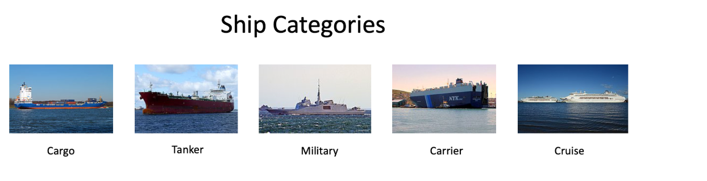

# AV Game Of Deep Learning
Game of Deep Learning Hackathon hosted by AV. A chance to win tickets to DataHack Summit 2019 and job opportunities with Analytics Vidhya.

## About Game of Deep Learning Hackathon
Are you excited about the Upcoming Battle for the Iron Throne? One of the most highly-anticipated moments, the battle amongst the Iron Throne contenders is finally going to happen.

While Daenerys Stormborn has set out on a journey to conquer the seven kingdoms and claim the Iron Throne, and we still have to wait till the final episode to know what her fate would be....till then, how about you claiming the throne of deep learning and seize opportunities at Analytics Vidhya kingdom? The Game of Deep Learning is your platform to claim your supremacy with innovative and exciting deep learning solutions to tackle a computer vision problem. This hackathon is designed to discover the best data scientists in the community. And what's more? Get handsomely rewarded for the same.

Deep learning is showing amazing promise for data science and AI, primarily because it’s methods get results and it keeps on improving with more data. Our current state of deep learning ability allows us to perform classification or identification tasks, speech recognition and more at super-human speed.

If you’ve been following us, you must be aware of the Analytics Vidhya Hiring Challenge we have conducted last seasons and we wanted to thank all of you who participated and made it a huge success. The winners walked away with fancy job opportunities at Analytics Vidhya. This time the stakes are even higher!!

# Problem Statement
Ship or vessel detection has a wide range of applications, in the areas of maritime safety,  fisheries management, marine pollution, defence and maritime security, protection from piracy, illegal migration, etc.

Keeping this in mind, a Governmental Maritime and Coastguard Agency is planning to deploy a computer vision based automated system to identify ship type only from the images taken by the survey boats. You have been hired as a consultant to build an efficient model for this project.

There are 5 classes of ships to be detected which are as follows:

## Dataset Description
There are 6252 images in train and 2680 images in test data. The categories of ships and their corresponding codes in the dataset are as follows -

{'Cargo': 1, 
'Military': 2, 
'Carrier': 3, 
'Cruise': 4, 
'Tankers': 5}

## Evaluation Metric
The Evaluation metric for this competition is **weighted F1 Score**

## Public and Private Split
Public leaderboard is based on randomly selected 30% of the test images, while private leaderboard will be evaluated on remaining 70% of the test images.

# Approach
* **AV-Game Of Deeplearning - Using FAST.AI**
* **Accuracy - 0.9449468503**
* **Accuracy on colab - 0.98994026**

# Leaderboard

* **[Public LB](https://datahack.analyticsvidhya.com/contest/game-of-deep-learning/lb)** : **160th/447 Rank**
* **[Private LB](https://datahack.analyticsvidhya.com/contest/game-of-deep-learning/pvt_lb)** : **146th/447 Rank**
